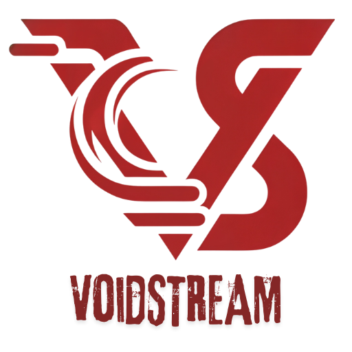

<p align="center">
   
</p>

<h1 align="center">VoidStream for Android TV</h1>
<h3 align="center">Enhanced Jellyfin client for Android TV, Nvidia Shield, and Amazon Fire TV devices</h3>

---

[](https://github.com/ToastyToast25/VoidStream-FireTV/releases)


**CI/CD Status:**

[](https://github.com/ToastyToast25/VoidStream-FireTV/actions/workflows/store-compliance.yaml)
[](https://github.com/ToastyToast25/VoidStream-FireTV/actions/workflows/code-quality.yaml)
[](https://github.com/ToastyToast25/VoidStream-FireTV/actions/workflows/test.yaml)
[](https://github.com/ToastyToast25/VoidStream-FireTV/actions/workflows/security.yaml)

<!-- Store Compliance validates both Amazon Appstore and Google Play policies -->

> **[← Back to main VoidStream project](https://github.com/ToastyToast25)**

VoidStream for Android TV is an enhanced fork of the official Jellyfin Android TV client, optimized for the viewing experience on Android TV, Nvidia Shield, Amazon Fire TV, and Google TV devices.

## Supported Devices & Platforms

| Platform | Minimum OS | Supported Devices |
|----------|-----------|-------------------|
| **Amazon Fire TV** | Fire OS 5+ (Android 5.1+) | Fire TV Stick (2nd Gen+), Fire TV Stick 4K, Fire TV Stick 4K Max, Fire TV Cube, Fire TV (3rd Gen+) |
| **Android TV** | Android 6.0 (Marshmallow) | Sony Bravia, Philips, Hisense, TCL, and other Android TV-certified devices |
| **Nvidia Shield** | Android 6.0+ | Shield TV (2015), Shield TV (2017), Shield TV (2019), Shield TV Pro |
| **Google TV** | Android 10+ | Chromecast with Google TV, TCL Google TV, Sony Google TV, and other Google TV devices |

**Minimum Android SDK:** API 23 (Android 6.0)

## Available Builds

VoidStream is distributed through multiple channels. Each build is tailored for its distribution platform.

| Build | Distribution | OTA Updates | Install Method |
|-------|-------------|-------------|----------------|
| **GitHub** | [GitHub Releases](https://github.com/ToastyToast25/VoidStream-FireTV/releases) | Built-in auto-updates | Sideload via Downloader app or ADB |
| **Amazon** | Amazon Appstore | Managed by Amazon | Install directly from Fire TV Appstore |
| **Google Play** | Google Play Store | Managed by Google Play | Install directly from Google Play Store |

### Build Differences

| Feature | GitHub | Amazon | Google Play |
|---------|--------|--------|-------------|
| OTA self-updates | Yes | No | No |
| Update notifications | Yes | No | No |
| Donate button | Yes | No | No |
| Install permission | Yes | No | No |
| Update channel | GitHub Releases API | Amazon Appstore | Google Play Store |
| Payment system | N/A | Amazon IAP | Google Play Billing |

## Features & Enhancements

VoidStream for Android TV builds on the solid foundation of Jellyfin with targeted improvements for TV viewing:

### Cross-Server Content Playback
- **Unified Library Support** - Seamless playback from multiple Jellyfin servers
- Seamless switching between servers for content playback
- Improved server selection logic

### SyncPlay (Beta)
- **Synchronized Group Playback** - Watch together with friends and family in perfect sync
- Dynamic playback speed adjustments based on drift calculations
- Buffering and ready state reporting for better synchronization
- User notifications for group join/leave events

### Playlist System
- **Full Playlist Support** - Create, manage, and share playlists
- Add to Playlist button on detail screens with modal selection
- Create new playlists or add to existing ones
- Public playlist support for sharing with other users
- Remove from Playlist on long press
- Replaced the previous local-only Watchlist feature

### Jellyseerr Integration

VoidStream is the first Android TV client with native Jellyseerr support.

- Browse trending, popular, and recommended movies/shows and filter content by Series/Movie Genres, Studio, Network, and keywords
- Request content in HD or 4K directly from your Roku
- **NSFW Content Filtering** (optional) using Jellyseerr/TMDB metadata
- Smart season selection when requesting TV shows
- View all your pending, approved, and available requests
- Authenticate using your Jellyfin login (permanent local API key saved)
- Global search includes Jellyseerr results
- Rich backdrop images for a more cinematic discovery experience

### MDBList Ratings Integration
- **Multiple Rating Sources** - Display ratings from various platforms:
  - AlloCine, AniList, Douban, IMDB, Kinopoisk
  - Letterboxd, Metacritic, MyAnimeList, Roger Ebert
  - TMDB, Trakt
- TMDB episode ratings support with configurable settings
- Episode ratings displayed in library views

### Customizable Toolbar
- **Toggle buttons** - Show/hide Shuffle, Genres, and Favorites buttons
- **Library row toggle** - Show/hide the entire library button row for a cleaner home screen
- **Shuffle filter** - Choose Movies only, TV Shows only, or Both
- **Pill-shaped design** - Subtle rounded background with better contrast
- Dynamic library buttons that scroll horizontally for 5+ libraries

### Featured Media Bar
- Rotating showcase of 15 random movies and TV shows right on your home screen
- **Profile-aware refresh** - Automatically refreshes content when switching profiles to prevent inappropriate content from appearing on child profiles
- See ratings, genres, runtime, and a quick overview without extra clicks
- Smooth crossfade transitions as items change, with matching backdrop images
- Height and positioning tuned for viewing from the couch

### Enhanced Navigation
- **Left Sidebar Navigation** - New sidebar with expandable icons/text and configurable navbar position
- **Folder View** - Browse media in folder structure for organized access
- Quick access home button (house icon) and search (magnifying glass)
- Shuffle button for instant random movie/TV show discovery with genre-specific shuffle on long press
- Genres redesigned as sortable tiles with random backdrop images
- Dynamic library buttons automatically populate based on your Jellyfin libraries
- One-click navigation to any library or collection directly from the toolbar
- Cleaner icon-based design for frequently used actions

### Playback & Media Control
- **ASS/SSA Subtitle Support** - Direct-play and rendering support for ASS/SSA subtitle formats
- **Subtitle Delay & Positioning** - Fine-tune subtitle sync and adjust position/size for wide aspect ratio videos
- **Max Video Resolution** - New preference to limit video resolution
- **Unpause Rewind** - Automatically rewinds a configurable amount when unpausing playback
- **Theme Music Playback** - Background theme music support for TV shows and movies with volume control
- **Pre-Playback Track Selection** - Choose your preferred audio track and subtitle before playback starts (configurable in settings)
- **Next Episode Countdown** - Skip button shows countdown timer when next episode is available
- **Automatic Screensaver Dimming** - Reduces brightness after 90 seconds of playback inactivity to prevent screen burn-in with dynamic logo/clock movement
- **Exit Confirmation Dialog** - Optional confirmation prompt when exiting the app (configurable in settings)
- **OTA Update System** - Automatic check for new VoidStream versions with in-app update notifications

### Improved Details Screen
- Metadata organized into clear sections: genres, directors, writers, studios, and runtime
- Taglines displayed above the description where available
- Cast photos appear as circles for a cleaner look
- Fits more useful information on screen without feeling cramped

### UI Polish
- **Adjustable Backdrop Blur** - Customizable background blur amount with slider control for personal preference
- **Media Bar Opacity Control** - Slider-based opacity adjustment for the featured media bar overlay
- Item details show up right in the row, no need to open every title to see what it is
- Buttons look better when not focused (transparent instead of distracting)
- Better contrast makes text easier to read
- Transitions and animations feel responsive
- Consistent icons and visual elements throughout

## Screenshots


## Videos
https://github.com/user-attachments/assets/5d89961b-8067-4af4-9757-b4de51474fcf

https://github.com/user-attachments/assets/0414ffca-60f4-470a-94b9-6b3405b3570c


---

**Disclaimer:** Screenshots shown in this documentation feature media content, artwork, and actor likenesses for demonstration purposes only. None of the media, studios, actors, or other content depicted are affiliated with, sponsored by, or endorsing the VoidStream client or the Jellyfin project. All rights to the portrayed content belong to their respective copyright holders. These screenshots are used solely to demonstrate the functionality and interface of the application.

---

## Installation

### Amazon Fire TV / Fire Stick

**From the Amazon Appstore (Recommended):**
Search for **"VoidStream"** in the Amazon Appstore on your Fire TV device and install directly. Updates are handled automatically by the Amazon Appstore.

**Sideload from GitHub (Advanced):**

<details>
<summary>Click to expand sideloading instructions</summary>

#### Step 1: Enable Developer Options
1. Go to **Settings** on your Fire TV
2. Select **My Fire TV** (or **Device & Software**)
3. Select **About**
4. Click on **your Fire TV name** 7 times rapidly until you see "You are now a developer"

#### Step 2: Enable Apps from Unknown Sources
1. Go back to **Settings → My Fire TV**
2. Select **Developer Options**
3. Turn on **Apps from Unknown Sources** (or **Install unknown apps**)
4. If prompted, confirm with **Turn On**

#### Step 3: Install the Downloader App
1. From the Fire TV home screen, go to **Find → Search**
2. Search for **"Downloader"** (by AFTVnews, orange icon)
3. Install and open the Downloader app
4. When prompted, allow Downloader to access files

#### Step 4: Download and Install VoidStream
1. Open the **Downloader** app
2. In the URL field, enter the download URL for the latest release:
   ```
   https://github.com/ToastyToast25/VoidStream-FireTV/releases/latest
   ```
3. Navigate to the **Assets** section and select the **github** `.apk` file
4. The APK will download — when finished, select **Install**
5. Once installed, select **Done** (or **Open** to launch immediately)
6. Go back to Downloader and select **Delete** to remove the APK file and free up space

#### Step 5: Launch VoidStream
1. Go to **Settings → Applications → Manage Installed Applications** to find VoidStream
2. Or look for **VoidStream** in your Apps & Channels row on the home screen
3. To move it to the front: long-press the app icon → select **Move to front**

</details>

### Android TV / Google TV

**From Google Play (Recommended):**
Search for **"VoidStream"** on the Google Play Store from your Android TV or Google TV device and install directly. Updates are handled automatically by Google Play.

**Sideload from GitHub:**
Download the **github** APK from the [Releases page](https://github.com/ToastyToast25/VoidStream-FireTV/releases) and install via USB drive, Downloader app, or ADB.

### Nvidia Shield TV

Install from **Google Play** on your Shield, or sideload the **github** APK from the [Releases page](https://github.com/ToastyToast25/VoidStream-FireTV/releases).

### Sideload via ADB (Any Device)

1. Enable **ADB Debugging** in Developer Options on your device
2. Find your device's IP address in Settings → Network
3. On your computer, connect via ADB:
   ```bash
   adb connect <DEVICE_IP>:5555
   ```
4. Download the **github** APK from the [Releases page](https://github.com/ToastyToast25/VoidStream-FireTV/releases)
5. Install via ADB:
   ```bash
   adb install voidstream-androidtv-v*-github-release.apk
   ```

### Updating VoidStream

- **Amazon Appstore & Google Play:** Updates are delivered automatically through the respective store.
- **GitHub (sideloaded):** VoidStream includes a built-in **OTA Update System** that automatically checks for new versions. When an update is available, you'll receive an in-app notification with the option to download and install directly — no need to repeat the sideloading steps.

## Jellyseerr Setup (Optional)
To enable media discovery and requesting:

1. Install and configure Jellyseerr on your network ([jellyseerr.dev](https://jellyseerr.dev))
2. In VoidStream, go to **Settings → Jellyseerr**
3. Enter your Jellyseerr server URL (e.g., `http://192.168.1.100:5055`)
4. Click **Connect with Jellyfin** and enter your Jellyfin password
5. Test the connection, then start discovering!

Your session is saved securely and will reconnect automatically.

## Building from Source

### Prerequisites

- Android Studio Arctic Fox or newer
- JDK 11 or newer
- Android SDK with API 23+ installed

### Build Commands

```bash
# Clone the repository
git clone https://github.com/ToastyToast25/VoidStream-FireTV.git
cd VoidStream-FireTV

# Build debug (github flavor)
./gradlew assembleGithubDebug

# Build release APKs (requires signing config)
./gradlew assembleGithubRelease    # Sideload build with OTA updates
./gradlew assembleAmazonRelease    # Amazon Appstore build
./gradlew assembleGoogleplayRelease # Google Play Store build
```

### APK Output Locations

```text
app/build/outputs/apk/github/release/voidstream-androidtv-v{VERSION}-github-release.apk
app/build/outputs/apk/amazon/release/voidstream-androidtv-v{VERSION}-amazon-release.apk
app/build/outputs/apk/googleplay/release/voidstream-androidtv-v{VERSION}-googleplay-release.apk
```

### Release Signing

Create a `keystore.properties` file in the root directory (use `keystore.properties.template` as a guide):

```properties
storeFile=/path/to/your/keystore.jks
storePassword=your_store_password
keyAlias=your_key_alias
keyPassword=your_key_password
```

## Development

### Developer Notes
- Uses Gradle wrapper (no need to install Gradle separately)
- Android Studio is recommended for development
- Keep Android SDK and build tools updated
- Code style follows upstream Jellyfin conventions
- UI changes should be tested on actual TV devices when possible

## Contributing

We welcome contributions to VoidStream for Android TV!

### Guidelines
1. **Check existing issues** - See if your idea/bug is already reported
2. **Discuss major changes** - Open an issue first for significant features
3. **Follow code style** - Match the existing codebase conventions
4. **Test on TV devices** - Verify changes work on actual Android TV hardware
5. **Consider upstream** - Features that benefit all users should go to Jellyfin first!

### Pull Request Process
1. Fork the repository
2. Create a feature branch (`git checkout -b feature/amazing-feature`)
3. Make your changes with clear commit messages
4. Test thoroughly on Android TV devices
5. Submit a pull request with a detailed description

## Translating

Translations are maintained through the Jellyfin Weblate instance:
- [Jellyfin Android TV on Weblate](https://translate.jellyfin.org/projects/jellyfin-android/jellyfin-androidtv)

Translations contributed to VoidStream that are universally applicable will be submitted upstream to benefit the entire community.

## Support & Community

- **Issues** - [GitHub Issues](https://github.com/ToastyToast25/VoidStream-FireTV/issues) for bugs and feature requests
- **Discussions** - [GitHub Discussions](https://github.com/ToastyToast25/VoidStream-FireTV/discussions) for questions and ideas
- **Upstream Jellyfin** - [jellyfin.org](https://jellyfin.org) for server-related questions

## Credits

VoidStream for Android TV is built upon the excellent work of:

- **[Jellyfin Project](https://jellyfin.org)** - The foundation and upstream codebase
- **[MakD](https://github.com/MakD)** - Original Jellyfin-Media-Bar concept that inspired our featured media bar
- **Jellyfin Android TV Contributors** - All the developers who built the original client
- **VoidStream Contributors** - Everyone who has contributed to this fork

## License

VoidStream for Android TV is licensed under **GPL v2** (GNU General Public License version 2).

This means:

- ✅ **Free and Open Source** - Full source code available to all users
- ✅ **Modify and Redistribute** - You can modify and share your changes
- ✅ **Build from Source** - Complete build instructions provided
- ⚠️ **Copyleft** - All modifications must remain GPL v2

### Plugin Ecosystem

VoidStream features a **modular plugin architecture** that allows both the client and Jellyfin server to be extended with additional functionality. Plugins are distributed separately from the core GPL-licensed application, enabling premium features while keeping the base client free and open source.

#### How Plugins Work

- **Separate Distribution** - Plugins are standalone APKs, not part of the core codebase
- **Independent Licensing** - Plugins can be proprietary and monetized
- **IPC Communication** - Plugins communicate with the core app via Android's AIDL interface
- **No GPL Contamination** - Plugin code remains separate, maintaining GPL compliance
- **Client & Server Enhancement** - Plugins can extend both VoidStream clients and Jellyfin servers

#### Official Plugins

**Official VoidStream plugins** are developed and maintained by the VoidStream team:

- ✅ **Quality Guaranteed** - Rigorously tested and maintained
- ✅ **Full Support** - Official support channels
- ✅ **Automatic Updates** - Via Google Play / Amazon Appstore
- 💰 **Paid Premium Features** - One-time purchase or subscription
- 🌐 **Cross-Platform License** - Buy once, use on all VoidStream clients (Android TV, Desktop, Web, Roku)

**Coming Soon:**
- **IPTV Plugin** - Live TV integration (M3U, EPG, Xtream Codes, Stalker)
- **Advanced Playback Plugin** - Enhanced codecs and audio processing
- **Smart Home Integration** - Control via Alexa, Google Assistant, Home Assistant

**Pricing Models:**

Plugins are offered with flexible pricing to suit different user needs:

| Plugin Type | Pricing Model | Example Price | Notes |
|-------------|---------------|---------------|-------|
| **IPTV Plugin** | One-time purchase | $9.99 | Lifetime access, all platforms |
| **Advanced Playback** | One-time purchase | $4.99 | Permanent unlock |
| **Smart Home** | One-time purchase | $2.99 | Buy once, use everywhere |
| **Premium Bundle** | Monthly subscription | $2.99/month | All current + future plugins |
| **Premium Bundle** | Annual subscription | $24.99/year | Save 30% vs monthly |

*Pricing examples are subject to change. Final pricing will be announced at launch.*

[View Official Plugin Catalog →](https://github.com/ToastyToast25/VoidStream-Plugins) *(Coming soon)*

#### Community Plugins

The VoidStream community can develop **unofficial plugins** using our open plugin API:

- 🔓 **Open API** - Plugin development SDK available to all
- 🌐 **Community-Driven** - Built by developers worldwide
- ⚠️ **Use at Own Risk** - Not officially supported by VoidStream
- 📝 **Various Licenses** - Community plugins may be free or paid

**Interested in building a plugin?** Check out our [Plugin Development Guide](docs/PLUGINS.md) *(Coming soon)*

[Browse Community Plugins →](https://github.com/ToastyToast25/VoidStream-Plugins/discussions) *(Coming soon)*

#### Future VoidStream Clients

The plugin ecosystem is designed to work across **all VoidStream platforms**:

- 📱 VoidStream for Android TV / Fire TV *(Current)*
- 💻 VoidStream Desktop *(Planned)*
- 🌐 VoidStream Web *(Planned)*
- 📺 VoidStream for Roku *(Planned)*

**🎁 Buy Once, Use Everywhere:** Purchase a plugin once and access it on all your VoidStream clients. Your plugin licenses are tied to your account, not a specific device or platform.

### Branding

The "VoidStream" name, logos, and visual assets are trademarks and remain proprietary even though the code is GPL.

See the [LICENSE](LICENSE) file for full GPL v2 terms.

---

<p align="center">
   
   <br>
   <strong>VoidStream for Android TV</strong> is an independent fork and is not affiliated with the Jellyfin project.<br>
   <a href="https://github.com/ToastyToast25">← Back to main VoidStream project</a>
</p>
